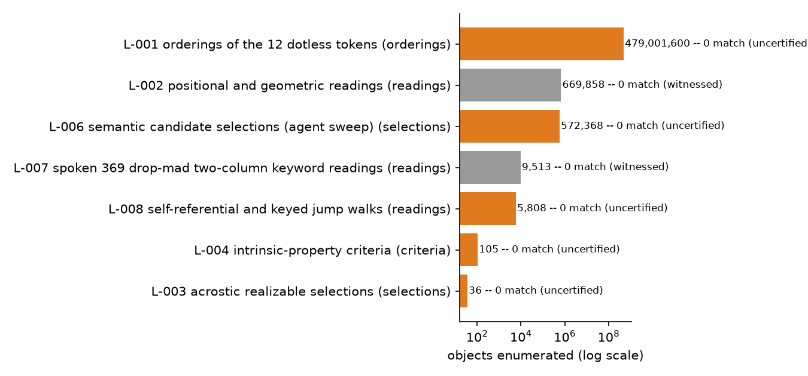

# Keysa: Crack the Seed Game (369,369 sats, [OPEN])

Keysa, a Bitcoin educator and author of "The Simplest Bitcoin Book Ever Written,"
posted a puzzle card on X and Nostr on 2023-06-26: 70 printed words, 12 of which are
the real 12-word seed for a wallet she funded with 369,369 sats. She never published
the wallet's address; I found it by matching the announced amount against a full
blockchain balance dump, corroborated by the wallet's script type and by the funding
transaction landing 2 minutes 28 seconds after her post. The escrow is still funded
and unspent 3 years later. The derivation (12 words in the right order to a BIP84
address) is fully understood and certified. What is missing is the selection rule
that picks 12 words out of 70: I have exhausted every mechanical and positional
reading I could enumerate, all negative, and the author's own words point toward a
short, spoken rule rather than a hidden calculation.

## At a glance

| | |
|---|---|
| Author | Keysa, [@SimplestBTCBook on X](https://x.com/SimplestBTCBook) |
| Published | 2023-06-26, X and Nostr ([original post](https://x.com/SimplestBTCBook/status/1673197111603519490)) |
| Prize | 369,369 sats (about $233 at BTC = $63,000, 2026-08-16) |
| Chain | bitcoin |
| Escrow | `bc1qcv84707v4sglaj306qezkcrun4eejh77k8cyjr` ([explorer](https://mempool.space/address/bc1qcv84707v4sglaj306qezkcrun4eejh77k8cyjr)) |
| Last on-chain check | 2026-08-17: funded and unspent (369,369 sats) |
| Status | OPEN |
| Puzzle type | bip39-seed, word-selection |
| Target format | BIP39 12 words (English), BIP84 `m/84'/0'/0'/0/0`, no passphrase |
| Certified oracle | yes: `tools/oracle.py --selftest` (certified against the public BIP39/BIP84 test vector) |
| What remains | the selection rule that picks 12 of the 70 printed words; the derivation itself is solved |
| Series | none |

## The puzzle as published

Keysa posted two images on 2023-06-26: a ciphertext card with 70 words
(`clues/L9rQ.jpg`) and a balance-proof card showing the wallet total
(`clues/qYkB.jpg`). Her original caption included the rule: 12 of the 70 words form
the real seed, and "you can ignore the dots." Twenty-five minutes later she
clarified an earlier remark: "The only hint is that it's a 12 word seed," meaning 12
words rather than 24, not "this puzzle among several of mine."

A 2024-11-12 notes-app screenshot of the same card (`clues/JkkBUuPyMHGcX0wB.jpg`)
shows the note's own title: **369369 Sats Guessing Game**. The matching BlueWallet
screenshot from that post (`clues/Q0aXztimD5PbhDUQ.jpg`) labels the wallet
**Crack the Seed Game HD SegWit...**, which matches BIP84.

In later posts she added detail without giving the rule away. On 2024-11-12: "a good
way to travel with your seed... you need an unforgettable way to decipher it," and,
describing how she shares a copy with a trusted person, "telling them the decryption
cipher as well." She also stated the dots on the card are "random, can ignore," and
that the wallet was generated by BlueWallet rather than by manual dice rolls
("I've never rolled 12 words," 2025-03-05). As late as 2024-11-12 she confirmed the
prize was still unclaimed: "many tried but so far the sats are still there." Short,
dated quotes with links are in [clues/author-posts.md](clues/author-posts.md).


*Figure 1. The published card and my transcription of its 70 tokens, with the 12 dotless tokens outlined (source: data/card-tokens.txt, script tools/fig_card_grid.py), 2026-08-16.*

## What is understood

### Mechanism

The card shows 70 tokens across 6 rows of 12, 12, 11, 12, 12, and 11 tokens (70
total, 67 distinct: `bless`, `lift`, and `beauty` each appear twice). All 70 tokens
are valid BIP39 English words. Twelve of them, in some order, form the real seed.
Selecting the 12 words in the correct order, deriving the BIP39 seed with an empty
passphrase, and deriving the BIP84 first receiving address (`m/84'/0'/0'/0/0`) must
reproduce the escrow address. The address's script type, `v0_p2wpkh`, matches BIP84,
and the balance-proof card is a BlueWallet screenshot, whose default HD path is also
BIP84: two independent signals agreeing on the derivation path.

Because every one of the 70 tokens is a valid BIP39 word, the checksum can never be
used to rule a selection in or out: a random 12-word draw from this specific set of
70 already passes the checksum about 1 time in 16, the same rate as for any 12
words. Every hypothesis in this folder was checked against the actual target
address, never filtered by checksum alone.

### Derivation and oracle

```
python3 tools/oracle.py --selftest
python3 tools/oracle.py "w1 w2 w3 w4 w5 w6 w7 w8 w9 w10 w11 w12"
```

The oracle validates the 12-word candidate as a BIP39 mnemonic (word count and
checksum), derives the BIP84 first receiving address, and compares it byte-exact to
the escrow address. `MATCH <address>` on a hit, `NO MATCH` otherwise (including when
the candidate fails BIP39 validation, since no address can be derived from it).
Exit code 0 or 1.

### Certified against

No solved sibling exists for this puzzle, so `tools/oracle.py --selftest` certifies
the derivation path against the public BIP39/BIP84 test vector: the mnemonic
"abandon" repeated 11 times plus "about" derives address
`bc1qcr8te4kr609gcawutmrza0j4xv80jy8z306fyu`, the standard published value for this
vector. The selftest also checks that a broken checksum and a wrong word count are
both correctly rejected. Reproduced 2026-08-16.

### Established facts

1. The escrow is funded and unspent as of 2026-08-17 (checked via
   [mempool.space](https://mempool.space)), 3 years after publication.
2. The author never published the escrow address; I identified it by matching the
   announced amount, 369,369 sats, against a full blockchain balance dump, then
   confirmed it by script type (`v0_p2wpkh`, matching BIP84) and by the funding
   transaction confirming 2 minutes 28 seconds after her original post.
3. The card transcribes to exactly 70 tokens in 6 rows of 12/12/11/12/12/11, 67
   distinct words, all valid BIP39 English words (`data/card-tokens.txt`).
4. The 6 rows are typed line breaks, not a display-width artifact: a narrower-column
   screenshot of the same note shows the rows wrapping with far more leftover space
   than an automatic reflow would leave (`analysis/tested.md`).
5. Exactly 12 of the 70 tokens carry no trailing dot on the card; this cardinality
   matches the target selection size exactly, though the author has twice stated the
   dots are random.
6. The checksum passes at the expected background rate (about 1 in 16) across every
   sweep run against this token set, confirming no bias in the derivation pipeline
   and confirming the checksum cannot discriminate a correct selection here.
7. The notes-app title of the card is "369369 Sats Guessing Game" (2024-11-12
   screenshot). The BlueWallet account name is "Crack the Seed Game" and the type
   string is HD SegWit, consistent with BIP84.

## What has been tested

Full ledger in [analysis/tested.md](analysis/tested.md). Summary:

| Hypothesis | Space | Method | Result | Witness | Date |
|---|---|---|---|---|---|
| All orderings of the 12 dotless tokens (L-001) | 479,001,600 orderings | exhaustive 12! permutation, BIP84 derive and compare | 0 match | uncertified: exhaustive but predates the witness protocol | 2026-08-02 |
| Positional and geometric readings (L-002) | 669,858 readings | periodic, self-referential, staircase, diagonal, mirrored, digit-based and punctuation-based families | 0 match | yes: known-good reading planted and recovered | 2026-08-02 |
| Semantic and mnemonic candidate selections (L-006) | 572,368 selections (439,773 distinct sets) | agent-driven candidate proposals under 114 labeled families, checked against the oracle | 0 match | uncertified: no single search order to plant a witness in | 2026-08-02 |
| Intrinsic token properties, including 3-6-9 digital roots (L-004) | 105 criteria | test whether any criterion partitions the 70 tokens into exactly 12 | no criterion reaches 12 (closest: 11 or 13) | uncertified: structural computation, not an oracle sweep | 2026-08-02 |
| Acrostic (initials spell a word) (L-003) | 1,723 composable 12-letter words | subsequence test against the 70 initials | 36 realizable, 0 match | uncertified: self-tested but no formal witness | 2026-08-02 |
| Spoken 369 / drop-mad / two-column / keyword readings (L-007) | 9,513 unique ordered sequences | AP periods 1-12, take-skip 3/6/9, 6x12 two-column, title-to-column, wrap-line control | 643 checksum-valid, 0 match | yes: constructed take-3-skip-6-take-9 and wrap-line sequences re-found and oracle-checked | 2026-08-17 |
| Self-referential and keyed jump walks (L-008) | 5,808 unique sequences | jump by token length / letters / 369 keys / greedy knight | 388 checksum-valid, 0 match | uncertified: certified oracle, no planted MATCH in this family's search order | 2026-08-17 |

Cumulative: about 480 million objects enumerated across 7 families (mixed units:
orderings, readings, selections, criteria, acrostic candidates), 0 matches.


*Figure 2. Coverage of the 7 tested hypothesis families, sized by objects enumerated and colored by witness status (source: data/coverage.csv, script tools/fig_coverage.py), 2026-08-17.*

## Open leads, ranked

1. **Write to the author** (needs a person). Keysa is active and has twice invited
   exactly this: "I would love to know if this method is solid" and "Open to
   comments." Near zero cost, highest plausible payoff, since the rule is described
   as short and meant to be spoken aloud.
2. **Submit argued candidate 12-word orderings** (minutes per candidate set on a
   rented GPU). Under her own post, a reader frames the puzzle around word order
   rather than selection, and Keysa's reply engages with counting permutations
   rather than correcting the framing. Checking one full 12! ordering sweep for a
   well-argued candidate set costs about 38 seconds on a rented GPU; the bottleneck
   is proposing the candidate set, not the derivation.
3. **The two-tokens-per-row bounded sweep** (about 76 minutes on one rented GPU).
   With the 6 rows confirmed authorial, picking exactly 2 tokens per row gives about
   3.6 billion candidates after the BIP39 checksum filter, at a measured rate of
   about 790,000 derivations per second.
4. **The double-width gap after "mad," and the "369 clock" theme** (needs new
   information). The note is titled "369369 Sats Guessing Game"; the obvious spoken
   369 selectors (take 3 skip 6 take 9, every 3rd from 3, columns 3 and 6) are now
   negatives in card order. The gap after `mad` likewise has no working selector yet.

## Files in this folder

| Path | What it is |
|---|---|
| `clues/L9rQ.jpg` | the ciphertext card as published, byte-exact from nostr.build |
| `clues/qYkB.jpg` | the balance-proof card as published, byte-exact from nostr.build |
| `clues/JkkBUuPyMHGcX0wB.jpg` | 2024-11-12 notes-app screenshot of the same card, including the title "369369 Sats Guessing Game" |
| `clues/Q0aXztimD5PbhDUQ.jpg` | 2024-11-12 BlueWallet screenshot, "Crack the Seed Game HD SegWit..." |
| `clues/author-posts.md` | dated quotes from Keysa's public posts, with links |
| `data/card-tokens.txt` | my transcription of the 70-token card, 6 rows, dots marked |
| `data/coverage.csv` | counts and witness status for the 7 tested hypothesis families |
| `analysis/tested.md` | the complete negatives ledger |
| `analysis/leads.md` | full notes behind the 4 ranked leads |
| `images/01-annotated-card-grid.png` | the published card plus a rendered transcription with dotless tokens outlined |
| `images/02-coverage-tested-space.png` | coverage bar chart of the 7 tested hypothesis families |
| `tools/oracle.py` | candidate checker, certified against the public BIP39/BIP84 test vector |
| `tools/fig_card_grid.py` | generates images/01-annotated-card-grid.png from clues/L9rQ.jpg and data/card-tokens.txt |
| `tools/fig_coverage.py` | generates images/02-coverage-tested-space.png from data/coverage.csv |

## Sources

- Keysa, original announcement, X, 2023-06-26: https://x.com/SimplestBTCBook/status/1673197111603519490
- Keysa on Nostr: https://njump.me/npub1dpna3xwwddnhhzg9ycpvlcz2ze0jdwm2rf3eqd2lf9leaewtq7tqhw0ef2
- Keysa, 2024-11-12 repost of the card (note title visible): https://njump.me/note13akmmtx96kyqvavmptu2wes0jawj0ad5ypp4v9sa9qf60zlr3dqqnf3h4d
- "The Simplest Bitcoin Book Ever Written," Keysa: https://simplestbitcoinbook.com
