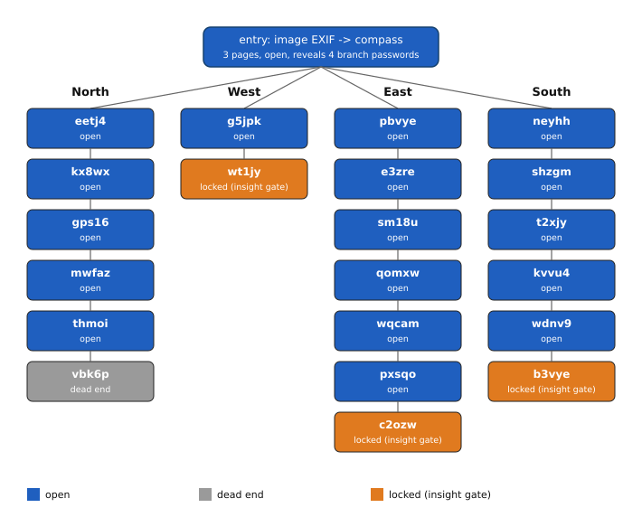

# Smith, Lyle & Moore Hunt #2: Glimmer (0.031777 BTC, [OPEN])

The band Smith, Lyle & Moore funded a second treasure hunt on their Wix site on 2022-07-29,
after a first hunt a reader solved and swept. The site is a roughly 70-page maze of
password-gated pages; an image's EXIF data opens a compass page revealing four branches.
Three branches end in a page whose password is an author-written riddle answer, not a
decoded cipher. North is a long side story, not a fourth insight lock: it prints four
tokens (hunt, gather, whale, blood) and then dies in Hell or on a "coming soon" stub.
All 12 BIP39 words and a passphrase needed to sweep the wallet still sit behind the three
riddle pages. I hold every password up to each lock and tested about 5,720 candidate
answers on those three gates with no hit. The published account xpub confirms the wallet
and derivation path; what is missing is the riddle answers, not the cryptography.

## At a glance

| | |
|---|---|
| Author | Smith, Lyle & Moore (band); site credited to Thom Miles Royle, [smithlylemoore.com](https://www.smithlylemoore.com/treasure-hunt) |
| Published | 2022-07-29, [smithlylemoore.com/treasure-hunt](https://www.smithlylemoore.com/treasure-hunt) |
| Prize | 0.031777 BTC (about $2,002 at BTC = $63,000, 2026-08-16) |
| Chain | bitcoin |
| Escrow | `bc1q0akdjvrc2csau2n3gyxa3xcq0fss852x997m9y` ([mempool.space](https://mempool.space/address/bc1q0akdjvrc2csau2n3gyxa3xcq0fss852x997m9y)) |
| Last on-chain check | 2026-08-17: funded and unspent (3,177,700 sats received, 0 spent, 1 transaction) |
| Status | OPEN |
| Puzzle type | bip39-seed, password-pages, web-tree |
| Target format | BIP39 12 words, English wordlist, plus a passphrase, BIP84 `m/84'/0'/0'/0/0`, P2WPKH |
| Certified oracle | yes: `tools/oracle.py --selftest` (certified against the published account xpub, whose m/0/0 P2WPKH address equals the escrow; see "Certified against" for the scope this does and does not cover) |
| What remains | the exact riddle answers for 3 password-gated pages; an insight problem, not a compute problem |
| Series | none (a first hunt on the same site, "Born to Be Wild", was solved and swept by another reader years ago; I use its known solution only as a template, see Mechanism) |

## The puzzle as published

The band's Wix site carries a `/treasure-hunt` page whose opening line reads "I Be The Ruler
of the Seven Seas". An image on that page carries EXIF GPS coordinates; entering the latitude
and then the longitude as consecutive page passwords opens a compass page that displays four
branch passwords in clear text: `north64`, `south64`, `east64`, and `west64`. Past that point
the site frames the hunt as a branching structure where some paths lead nowhere and others
lead to the treasure.

Three branches (West, East, South) each end on one password-gated page. The riddle text sits
on the open page immediately before the lock; I quote it in
[clues/author-posts.md](clues/author-posts.md): a pirate-themed riddle naming Blackbeard,
Napster's Shawn Fanning, Metallica's Lars Ulrich, Silk Road's Ross Ulbricht, and Pirate
Bay's Gottfrid Svartholm and Fredrik Neij (West, on `/west`, lock `/message`); a deep-sea
narcosis riddle asking "is this the end?" (East, on `/weallliveinayellowsubmarine`, lock
`/take-a-big-breath`); and Name 5 asking for the next castaway after Ginger (South, lock
slug `havingfunwiththeurl-ilovedthisshowasakid-sosomuch`). The fourth branch, North, is
now fully walked: a bottle message, a land-ho fork, a hitchhiker death ending, and a Cape
Cod "coming soon" stub dated 2022-09-09.

The band's earlier hunt, "Born to Be Wild" (2021, an Apollo/moon theme on the same site), was
solved and swept by a reader; no write-up of that solution or of this second hunt exists that
I have found, beyond a 2024-08-23 stacker.news post flagging this hunt as still unsolved.

## What is understood

### Mechanism

The published wallet is a standard BIP39 seed with a passphrase, derived along BIP84 to a
P2WPKH address. The 12 words and the passphrase are scattered as fragments behind the three
locked pages; I have not recovered any of them. North prints hunt / gather / whale / blood;
three of those sit on the BIP39 English list and `whale` does not, so that bottle is not a
4-word seed fragment. Full channel map in [analysis/mechanism.md](analysis/mechanism.md).


*Figure 1. The full page-chain structure reached from the entry page, by branch and state (source: data/site-structure.csv, script tools/fig_structure.py), 2026-08-17.*

### Derivation and oracle

```
python3 tools/oracle.py --selftest                      # must print SELFTEST OK
python3 tools/oracle.py "w1 w2 ... w12"                  # empty passphrase
python3 tools/oracle.py "w1 w2 ... w12" "passphrase"     # with passphrase
python3 tools/oracle.py --stdin                          # "mnemonic:passphrase" per line
```

A candidate mnemonic is validated against the BIP39 checksum, turned into a seed with the
given passphrase, and walked down the standard BIP32/44/49/84 account paths. A match is
reported if the resulting account extended public key equals the author's published xpub, or
if the resulting `.../0/0` P2WPKH address equals the escrow. `MATCH ... address=... WIF=...`
on a hit, `NO MATCH` otherwise, exit code 0 or 1. On a match, the WIF sweeps directly to my
own wallet, `bc1qax0hsnwnxl7393awtc3hsy0ftm6tg4tyk2nfja` ([mempool.space](https://mempool.space/address/bc1qax0hsnwnxl7393awtc3hsy0ftm6tg4tyk2nfja)).

### Certified against

The author published the wallet's account xpub,
`xpub6CpNc58zqQvNGPHDGGTr68wgrmtfFDBWRuSDAxoDdrCE1iRAaZtyAD5T9uCJ3ELUYKCkx8Jkind2kwoR3Uxmg1ycQ6DWyGxZBMFvQqhNqVC`,
directly on the puzzle site. `tools/oracle.py --selftest` reproduces that its `m/0/0` address
in P2WPKH form equals the escrow, and separately confirms that a known-wrong mnemonic (the
public BIP39 test vector "abandon...about") produces `NO MATCH`, so the harness both accepts
and rejects correctly. Reproduced 2026-08-16.

This certifies the BIP32-derivation and P2WPKH-encoding half of the pipeline. It does not
certify the BIP39-mnemonic-to-seed half end to end, because no 12-word mnemonic that actually
reproduces this xpub is known to me: 0 of 12 words are held. A `NO MATCH` from this oracle is
trustworthy math; it is not evidence about whether a given set of words is the right set.

### Established facts

1. The escrow is funded and unspent: 3,177,700 sats received in 1 transaction on 2022-07-29,
   0 spent, confirmed via [mempool.space](https://mempool.space/address/bc1q0akdjvrc2csau2n3gyxa3xcq0fss852x997m9y) on 2026-08-17.
2. The published account xpub's `m/0/0` address, encoded as P2WPKH, equals the escrow
   (`tools/oracle.py --selftest`).
3. Page passwords on this site are case sensitive: `Gilligan` succeeds only in Title Case,
   and `west64` succeeds only in lowercase.
4. North is not an insight lock. Password `glimmer` opens the whale-message page, which
   prints hunt / gather / whale / blood and the derived password `huntgathwhalblo`. Those
   four tokens are not a BIP39-valid set (`whale` is not on the English wordlist) and do not
   open West, East, or South. The land chain behind them is a death ending (`sleighride` ->
   `666`) or a 2022-09-09 "coming soon" stub (`vampire`).
5. The West and East locks require lowercase, single-token passwords with no digits, matching
   every other password already known on those branches. The South lock is Title Case; spaced
   `Mary Ann` opens the tropical-island page `jetkc` and is rejected on Name 6 (`b3vye`).
6. No numeric suffix appears in any password I have opened that is not directly visible in an
   image on that same page, or printed in clear text on the previous page.
7. The site's password gate is enforced server side. The live resolver returns hit URLs
   under `payload.urls` (HTTP 200) and misses as HTTP 403 `errorCode -17005`.
8. East and West merge into one pirate spine after West's lock: `albatross` -> `semaphore`
   -> `youshallpass47` -> `witchoftheeast` -> Titanic death (`2hours40minutes` / `777`) or
   yellow submarine (`20000leagues`) -> East lock. The pirate "fight" sibling (`y6cd1`) is
   still closed.

## What has been tested

Full ledger in [analysis/tested.md](analysis/tested.md). Summary:

| Hypothesis | Space | Method | Result | Witness | Date |
|---|---|---|---|---|---|
| West lock: a single word connects the riddle's named pirates | about 2,100 candidates, overwhelmingly lowercase | direct page-password submission | 0 match | uncertified: no known-good candidate for this locked page | 2026-07-25 |
| East lock: a diving/pop-culture term answers "is this the end?" | about 2,030 candidates | direct page-password submission | 0 match | uncertified: no known-good candidate for this locked page | 2026-07-25 |
| South lock: the sixth Gilligan's Island castaway, full show canon | about 775 candidates, Title Case | direct page-password submission | 0 match, canon exhausted | uncertified: no known-good candidate for this locked page | 2026-07-25 |
| Puzzle-wide lowercase password rule | 2 known passwords retested in 3 case forms each | direct page-password submission on open gates | refuted: only Title Case succeeds | yes: both known-good passwords reproduced | 2026-07-25 |
| Cover-art trailer-byte channel (word 1) | 1,585 images | byte scan after EOF, same method that finds the real payload on the solved Hunt #1 cover | 0 match on Hunt #2 material | yes: positive control on the Hunt #1 cover | 2026-07-14 |
| Audio steganography on the public master | 1 file, 4 techniques | Morse/reverse/LSB/spectrogram analysis | 0 match, no alternate mix found | uncertified | 2026-07-10 |
| Three locks, high-value list under the corrected Wix resolver | 151 unique strings | direct page-password submission | 0 match on the 3 locks; `glimmer` and spaced `Mary Ann` hit other pages | yes: `west64` and `Ginger` re-accepted | 2026-08-17 |

Cumulative across the 3 insight locks: about 5,720 unique strings, 0 hits. A 151-string
high-value retest on 2026-08-17 is certified against the live resolver (witness `west64` /
`Ginger`). Earlier lock rows stay uncertified in the witness sense above.

## Open leads, ranked

1. **A fresh reading of the South lock's own slug pun** (needs new information). Name 6 is
   not `Roy` / `Professor` / spaced `Mary Ann`. The live slug is
   `havingfunwiththeurl-ilovedthisshowasakid-sosomuch`. Spaced `Mary Ann` opens the
   tropical-island page without opening Name 6; raft and fire on that island are still
   closed. Confirmed if any reading opens `b3vye`.
2. **Reverse image search the `LifeFlashBeforeEyes.mp4` clip stills on the East branch**
   (hours). Stills include a night Saturn V, a hillside couple, a Cabo-like sunset, and
   slit-scan warp passages. Glimmer lyric concatenations already miss. Confirmed if a
   named source title opens `c2ozw`.
3. **West lock: not another spelling of the named surnames** (minutes to hours). Princess
   Bride / Silk Road / `pirateship.gif` concatenations miss. Next try is a different
   reading of "coming from the treasure", or the still-closed fight page `y6cd1`.
4. **Open the pirate fight page `y6cd1`** (minutes once a password is found). Sibling of
   the semaphore path; may constrain West.

Full notes: [analysis/leads.md](analysis/leads.md).

## Files in this folder

| Path | What it is |
|---|---|
| `clues/author-posts.md` | verbatim riddle text and entry-page quotes from the puzzle site, with links |
| `data/site-structure.csv` | the page chain per branch (page id, state), from direct site navigation |
| `analysis/mechanism.md` | the full 7-channel carrier map and branch-format rules |
| `analysis/tested.md` | the complete negatives ledger |
| `analysis/leads.md` | full notes behind the 4 ranked leads |
| `images/02-structure-branches.svg` | the site's branch structure, colored by state |
| `tools/oracle.py` | candidate checker (mnemonic plus passphrase against the escrow), certified |
| `tools/fig_structure.py` | generates images/02-structure-branches.svg from data/site-structure.csv |

## Sources

- Smith, Lyle & Moore, Treasure Hunt page, smithlylemoore.com, 2022-07-29: https://www.smithlylemoore.com/treasure-hunt
- "Bitcoin Treasure Hunt - 2021 (still unsolved)", stacker.news item 658645, @DrStacker, 2024-08-23: https://stacker.news/items/658645
- Escrow address, mempool.space: https://mempool.space/address/bc1q0akdjvrc2csau2n3gyxa3xcq0fss852x997m9y
